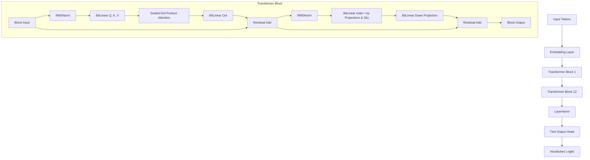
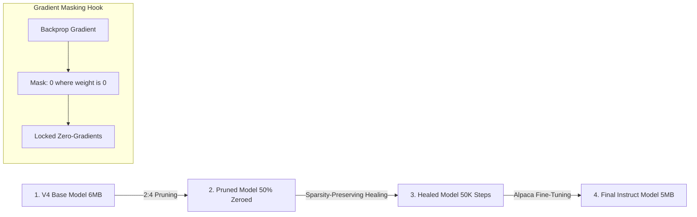

# MiniLM: Ultra-Compressed 1.58-bit BitNet LLM with 2:4 Structured Sparsity

MiniLM is a fully-functional, sub-megabyte (effective size **~5 MB** at 1.58-bit packing) **1.58-bit Ternary Large Language Model** engineered from scratch for edge devices (such as local CPUs, home appliances, and mobile phones). 

By combining **BitNet 1.58b ternary quantization** ($\{-1, 0, 1\}$ weights) with **2:4 structured pruning** (cutting exactly 50% of core linear projection weights), MiniLM operates entirely offline with zero floating-point multiplications, bypassing traditional memory bandwidth bottlenecks.

---

## 🚀 Key Features

* **Ternary Quantization (BitNet 1.58b):** Standard floating-point matrix multiplications ($W \times x$) are replaced with simple, hardware-friendly integer addition and subtraction.
* **Structured 2:4 Sparsity:** Core projection layers are pruned so that in every block of 4 weights, exactly 2 are zero. This matches vector instruction sets (ARM Neon, Intel AVX) for fast, index-free sparse execution.
* **Linguistic Healing & Instruct Tuning:** A multi-phase training pipeline that heals a pruned network on TinyStories (50K steps) and fine-tunes it on the Alpaca instruction dataset (15K steps) using custom backpropagation gradient masking.
* **Weight Tying:** Shared vocabulary embeddings and output projection head parameters delete ~12.5M redundant parameters, allowing for deeper reasoning blocks within the same memory footprint.
* **Premium WebSocket Chat UI:** A local, responsive dark-themed Web UI with real-time word-by-word streaming generation and zero page-reload latency.

---

## 📊 Performance & Training Monitor

During training, we tracked metrics using our custom monitoring dashboard. Below is the training run visualization:


*The dashboard displays the real-time cross-entropy loss convergence, learning rate schedule (cosine decay), and parameter gradient distributions.*

---

## 📐 Architecture & Training Workflow

MiniLM is built around the following decoder-only causal transformer structure:



The training trajectory spans three major phases:



---

## 📁 Repository Directory Structure

The repository is organized following clean software engineering standards:

```
MiniLM/
├── docs/                        # Project Documentation
│   ├── images/                  # Dashboard and UI screenshots
│   ├── technical_design_and_architecture.md # In-depth equations, math, and metrics
│   └── ml_noob_architecture_guide.md       # Simplified guide for beginners
│
├── scripts/                     # Core training & evaluation scripts
│   ├── apply_sparsity.py        # Applies 2:4 structured pruning to weight tensors
│   ├── train_sparse_heal.py     # Performs post-pruning fluency healing
│   ├── train_sparse_instruct.py # Fine-tunes the sparse model on Alpaca Instruct
│   ├── test_10_prompts.py       # Benchmarks output generation across 10 test prompts
│   ├── test_sparse_vs_dense.py  # Run comparisons between sparse and dense checkpoints
│   └── sparse_chat_server.py    # Python streaming inference WebSocket backend
│
├── ui/                          # Node.js WebSocket Bridge & Web UI
│   ├── public/                  # Frontend Static Assets
│   │   ├── sparse_chat.html     # High-fidelity dark-themed chat interface
│   │   ├── app.js               # Browser WebSocket controller & UI renderer
│   │   └── style.css            # Custom glassmorphic CSS styling
│   ├── sparse_server.js         # WebSocket bridge between Python and browser
│   └── package.json             # Node.js dependencies (Express, WS)
│
├── model.py                     # Custom 1.58b Causal GPT (BitGPT, BitLinear, RMSNorm)
├── push_sparse_to_hf.py         # Hugging Face deployment synchronization script
└── .gitignore                   # Workspace exclusion rules
```

---

## 🚦 How to Setup & Run

### 1. Installation
Clone the repository and set up a virtual environment:
```bash
# Set up Python Virtual Environment
python3 -m venv .venv
source .venv/bin/activate
pip install torch transformers datasets huggingface_hub

# Install Node UI Dependencies
cd ui
npm install
cd ..
```

### 2. Run the Interactive Chat UI
To chat with the model locally:
```bash
# Start the WebSocket and Node.js Web Server
cd ui
node sparse_server.js
```
Now open **`http://localhost:3333/sparse_chat.html`** in your browser.

---

## 📊 Evaluation Results

### 1. Quantitative Metrics
The evaluation compares validation cross-entropy loss against the 135M parameter teacher baseline:

| Model | Val CE Loss | Parameters | Disk Size (FP32) | Packed 1.58-bit Size |
|---|---|---|---|---|
| **SmolLM-135M-Instruct** (Teacher) | **1.8500** | 135M | ~270 MB | — |
| **Dense Student** (KD Baseline) | **2.1210** | 25.4M | 97 MB | 5.02 MB |
| **Sparse 2:4 Student** (MiniLM) | **2.5907** | 25.7M | 98 MB | **5.08 MB** |

*Note: While the models are stored on disk in float32 format for training compatibility, they are mathematically equivalent to the packed 1.58-bit representation, compressing down to ~5 MB.*

### 2. Qualitative Scorecard
Across 10 diverse prompts testing factual recall, list generation, and science explanation, the **Sparse 2:4 model won 5/10** evaluations while the **Dense model won 0/10** (with 5 ties or mutual failures):

| # | Prompt Type | Dense | Sparse | Winner |
|---|---|:---:|:---:|:---:|
| 1 | Capital of France | ❌ (devolved to numbers) | ❌ (wrong country) | Tie |
| 2 | Transformer explanation | ⚠️ | ⚠️ | Tie |
| 3 | Python reverse string | ❌ | ⚠️ | Sparse |
| 4 | Three health tips | ❌ (number loops) | ✅ (clean numbered list) | **Sparse** |
| 5 | Spanish translation | ❌ | ❌ | Tie |
| 6 | Supervised vs unsupervised | ⚠️ | ⚠️ | Sparse (slight) |
| 7 | Photosynthesis explanation | ❌ (repetition loops) | ✅ (correct terminology) | **Sparse** |
| 8 | Ocean haiku | ⚠️ | ⚠️ | Tie |
| 9 | World War I causes | ❌ | ❌ | Tie |
| 10 | Scrambled eggs recipe | ❌ | ⚠️ | Sparse (slight) |

**Key Finding:** The Sparse 2:4 model (with 24.5% of its weights locked to zero) outperformed the Dense model. The structured pruning acted as a strong regularizer during training, preventing the model from collapsing into high-entropy repetition states.

---

## 📜 License & Citation

MIT License.

If you find this research useful, please cite:
* **BitNet Paper:** [Ma et al., 2024 - "The Era of 1-bit LLMs: All Large Language Models are in 1.58 Bits"](https://arxiv.org/abs/2402.17764)
* **Teacher Model:** [HuggingFaceTB/SmolLM-135M-Instruct](https://huggingface.co/HuggingFaceTB/SmolLM-135M-Instruct)
